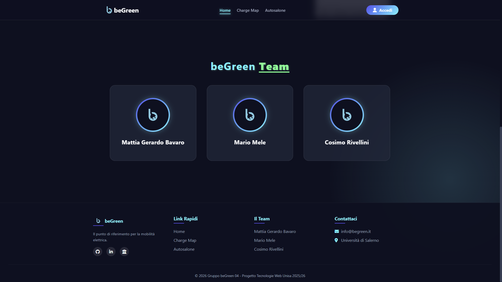

# 🌱 beGreen - Full Stack Web App

**Full-stack web application supporting electric mobility**, providing tools for charging station discovery, charging time estimation, an electric vehicle catalog and a role-based community platform.


🏫 This project was developed as part of the **2025/26 Web Technologies course**  
at the **University of Salerno (Università degli Studi di Salerno, Italy)**.

---

## 📌 Table of Contents
- [Project Overview](#-project-overview)
- [Technologies & Dependencies](#-technologies--dependencies)
- [Main Features](#-main-features)
- [UI Preview](#-ui-preview)
- [Project Structure](#-project-structure)
- [Language & Naming Conventions](#-language--naming-conventions)
- [Setup & Run](#-setup--run)
- [Team Members](#-team-members)

---
## 🔍 Project Overview

**beGreen** is a dynamic full-stack web application designed to support the transition towards **sustainable electric mobility**.

The platform targets electric vehicle users by offering:
- real-time visualization of nearby charging stations,
- estimation of charging times based on vehicle and station characteristics,
- an interactive catalog of electric vehicles,
- a community forum with role-based access.

The project was developed as a **complete academic case study**, covering:
- requirements analysis,
- system design,
- database modeling,
- frontend and backend implementation,
- security and access control mechanisms.

Special attention was given to:
- usability and responsiveness,
- integration of external APIs,
- correct use of modern Web technologies,
- separation of concerns between presentation, logic and data layers.

---
## 🛠 Technologies & Dependencies


The **beGreen** platform is implemented using standard Web technologies, with a clear separation between frontend, backend and data layers.

### Backend
- **PHP** – server-side logic and session management
- **PostgreSQL** – relational database management system
- **SQL** – data definition, manipulation and seeding

### Frontend
- **HTML5** – semantic structure and modern browser APIs
- **CSS3** – responsive layout and visual styling
- **JavaScript (Vanilla JS)** – dynamic interactions and client-side logic

### External APIs & Libraries
- **Open Charge Map API** – real-time data about electric charging stations
- **Leaflet.js** – interactive map rendering and marker management

### Security & Web Features
- **Password Hashing** – secure password storage using `password_hash()` (Bcrypt)
- **RBAC (Role-Based Access Control)** – differentiated access for Guest, Standard, Plus+ and Admin users
- **HTML5 Geolocation API** – user position detection
- **HTML5 Drag & Drop API** – interactive vehicle selection in the autosalon

### Development Environment
- **Local Web Server** (e.g. Apache via XAMPP)


---

## ✅ Main Features

### 🏠 Home
- Dynamic homepage introducing the web application mission and goals.
- Role-aware navigation bar that adapts to the user authentication state.
- Presentation of the development team and quick links to documentation.
- Responsive layout with semantic HTML5 elements (`header`, `nav`, `section`, `footer`).

---

### 🗺️ Charge Map
- Interactive map centered on the user's real-time geographical position.
- Integration with **Open Charge Map API** to retrieve nearby charging stations within a defined radius.
- Dynamic marker rendering using **Leaflet.js**.
- Customized marker indicating the user's current location.
- Detailed station popups displaying technical information.
- Charging time estimation for authenticated users:
  - selection of a vehicle from the database,
  - calculation based on vehicle battery capacity and station power.

---

### 🚗 Autosalon
- Dynamic catalog of electric vehicles retrieved from the database.
- Interactive **Drag & Drop** interface for vehicle selection.
- Creation of a simulated quotation by dragging vehicles into a dedicated area.
- Access control:
  - browsing available to all users,
  - information request form enabled only for registered users.

---

### 👤 Authentication & User Profile
- Unified authentication page handling both **Login** and **Registration**.
- Client-side validation and sticky forms to improve usability.
- Secure password storage using hashing algorithms.
- Role-based redirects after authentication.
- Personal user dashboard displaying account data:
  - username,
  - email,
  - assigned role.
- Password change functionality with current-password verification.
- Upgrade to **Plus+ user** through a simulated payment process.

---

### 💬 Community+
- Forum section reserved for **Plus+ users** and **Administrators**.
- Card-based visualization of discussion topics.
- Asynchronous creation of new discussions without page reload.
- Structured posts with title, category and author information.

---

### 🛠 Admin Panel
- Restricted access available only to **Administrator** users.
- Centralized dashboard for managing the platform ecosystem.
- Full **CRUD (Create, Read, Update, Delete)** operations on:
  - registered users,
  - electric vehicles,
  - community discussions.
- Enforcement of database integrity and role constraints.
---

## 💻 UI Preview


---

## 🧱 Project Structure

The project follows a clear and modular directory structure, separating presentation, logic, assets and documentation.

```markdown
beGreen/  
├── docs/ # Project documentation (PDF)  
├── src/  
│ ├── css/ # Global stylesheet  
│ │ └── style.css  
│ ├── js/ # Client-side scripts  
│ │ ├── map.js # Map logic and API integration  
│ │ ├── autosalone.js # Drag & Drop logic for the autosalon  
│ │ └── log.js # Authentication-related scripts  
│ ├── page/ # PHP application pages  
│ │ ├── home.php  
│ │ ├── map.php  
│ │ ├── autosalone.php  
│ │ ├── community.php  
│ │ ├── profile.php  
│ │ ├── admin.php  
│ │ ├── log.php # Login & registration  
│ │ ├── logout.php  
│ │ └── db.php # Database connection and utilities  
│ ├── src_image/ # Static media assets  
│ │ ├── images/ # Logos, icons and UI images  
│ │ └── favicon/ # Application favicons  
│ └── external_file/ # External resources and backups  
│ └── beGreen_Project.pdf  
├── db_tw.sql # Database schema and data seeding  
└── README.md # Project documentation
```
---
## 🌐 Language & Naming Conventions

This project was developed as part of the **Web Technologies course** at the  
**University of Salerno (Università degli Studi di Salerno, Italy)**.

To maintain clarity and consistency, the following conventions were adopted:

- **Source code identifiers** (file names, variables, functions) are written in **English**.
- **User interface labels and content** are primarily in **Italian**, in accordance with the course requirements and target audience.
- **Database entities and fields** use English naming conventions for readability and maintainability.
- Naming follows common web development practices to ensure:
  - code readability,
  - ease of collaboration,
  - alignment with international development standards.

This mixed approach allows the project to remain:
- compliant with the academic context,
- understandable by an international audience.
---
## 🚀 Setup & Run

The following instructions describe how to set up and run the **beGreen** web application locally.

### Prerequisites
- **PHP 8.x** or newer
- **PostgreSQL 14+**
- **Local Web Server** (e.g. Apache via XAMPP, MAMP or similar)
- **Modern Web Browser** (Chrome, Firefox, Edge)

---

### 1️⃣ Clone the repository
```bash
git clone https://github.com/<your-username>/beGreen.git
cd beGreen
```
### 2️⃣ Database setup
1) Create a new PostgreSQL database named:
```text
TW
```
2) Create (or reuse) a PostgreSQL user with sufficient privileges.

3) Import the provided SQL script:
```bash
psql -U <db_user> -d TW -f db_tw.sql
```
This script will:

-   remove existing tables (if any),
-   create all required tables and constraints,
-   define user roles,
-   populate the database with demo users and vehicles.

4) Configure database credentials by editing:
```text
src/page/db.php
```
### 3️⃣ Run the App
1) Move the project directory into your web server root.
2) Start the web server and PostgreSQL service.
3) Open your browser and navigate to:
```text
http://localhost/beGreen/src/page/home.php
```
### 4️⃣ Demo Accounts

The database is pre-populated with test users that allow access to all application features:

| Role  | Email                     | Password |
|------ |---------------------------|----------|
| User  | gerardo@studenti.unisa.it  | 123456   |
| User  | s.senatore@unisa.it        | 30elode  |
| Admin | admin@begreen.it          | admin    |

### ⚠️ Notes

- The **Plus+ account upgrade** is simulated and does not involve real payment systems.
- The application is intended for **academic and educational purposes only**.
- External APIs (e.g. **Open Charge Map**) require an active internet connection.

---

## 🐺 Team Members

- ◽ [Mattia Gerardo Bavaro](https://github.com/mattiajb)
- ◽ [Mario Mele](https://github.com/melem878)
- ◽ [Cosimo Rivellini](https://github.com/crivellini)
